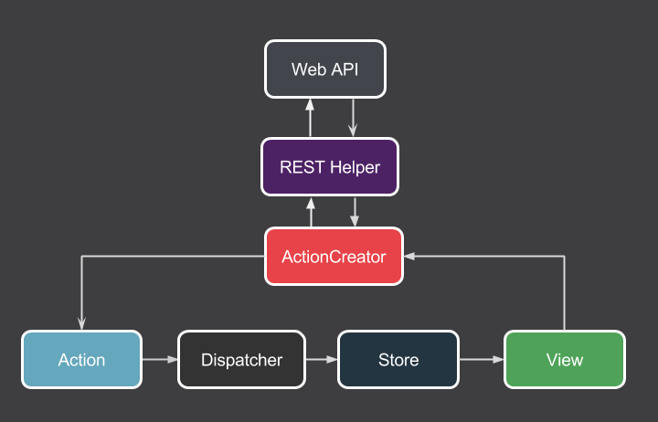

# HybRxFlux
呼应宝客户端
## 项目架构
项目中使用[**Flux**](http://www.jianshu.com/p/896ce1a8e4ed)架构.

## 后台API文档
[**huyingbao-ShowDoc**](https://www.showdoc.cc/15310)，访问密码123456

## 第三方框架
- 项目整体框架[**RxFlux**](https://github.com/skimarxall/RxFlux)
- 函数响应式编程[**RxJava**](https://github.com/ReactiveX/RxJava)+[**RxAndroid**](https://github.com/ReactiveX/RxAndroid)
+[**RxBinding**](https://github.com/JakeWharton/RxBinding)+[**RxLifecycle**](https://github.com/trello/RxLifecycle)+[**RxPermissions**](https://github.com/tbruyelle/RxPermissions)
- 网络框架[**OkHttp**](https://github.com/square/okhttp)+[**OkIo**](https://github.com/square/okio)+[**Retrofit**](https://github.com/square/retrofit)+[**OkHttpWs**](http://mvnrepository.com/artifact/com.squareup.okhttp3/okhttp-ws)
- 图片加载处理[**Glide**](https://github.com/bumptech/glide)+[**Glide Transformations**](https://github.com/wasabeef/glide-transformations)
+[**Okhttp3-integration**](https://github.com/bumptech/glide/wiki/Integration-Libraries)
- Recycler通用Adapter[**BaseRecyclerViewAdapterHelper**](https://github.com/CymChad/BaseRecyclerViewAdapterHelper)
- Recycler通用分割线[**Flexibledivider**](https://github.com/yqritc/RecyclerView-FlexibleDivider)
- 依赖注入[**Dagger2**](https://github.com/google/dagger)+[**ButterKnife**](https://github.com/JakeWharton/butterknife)
- Lambda表达式[**RetroLambda**](https://github.com/orfjackal/retrolambda)+[**GradleRetroLambda**](https://github.com/evant/gradle-retrolambda)
- 内存泄漏检测[**LeakCanary**](https://github.com/square/leakcanary)
- Log日志展示[**Logger**](https://github.com/orhanobut/logger)
- 数据缓存[**Snappydb**](https://github.com/nhachicha/SnappyDB)
- 数据库[**DBFlow**](https://github.com/Raizlabs/DBFlow)
- 图片缩放[**PhotoView**](https://github.com/chrisbanes/PhotoView)
- 热修复[**Hotfix**](https://help.aliyun.com/document_detail/53240.html?spm=5176.doc53287.6.546.Um4owA)
- Json解析[**Fastjson**](https://github.com/alibaba/fastjson)+[**Gson**](https://github.com/google/gson)+[**RetrofitConverterFastjson**](https://github.com/ligboy/retrofit-converter-fastjson)
- 混合框架[**React**](https://github.com/facebook/react)+[**ReactNative**](https://github.com/facebook/react-native)
- 二维码扫描[**zxing-android-embedded**](https://github.com/journeyapps/zxing-android-embedded)
# License
Copyright 2017 liujunfeng

Licensed under the Apache License, Version 2.0 (the "License"); you may not use this file except in compliance with the License. You may obtain a copy of the License at

[http://www.apache.org/licenses/LICENSE-2.0](http://www.apache.org/licenses/LICENSE-2.0)

Unless required by applicable law or agreed to in writing, software distributed under the License is distributed on an "AS IS" BASIS, WITHOUT WARRANTIES OR CONDITIONS OF ANY KIND, either express or implied. See the License for the specific language governing permissions and limitations under the License.
